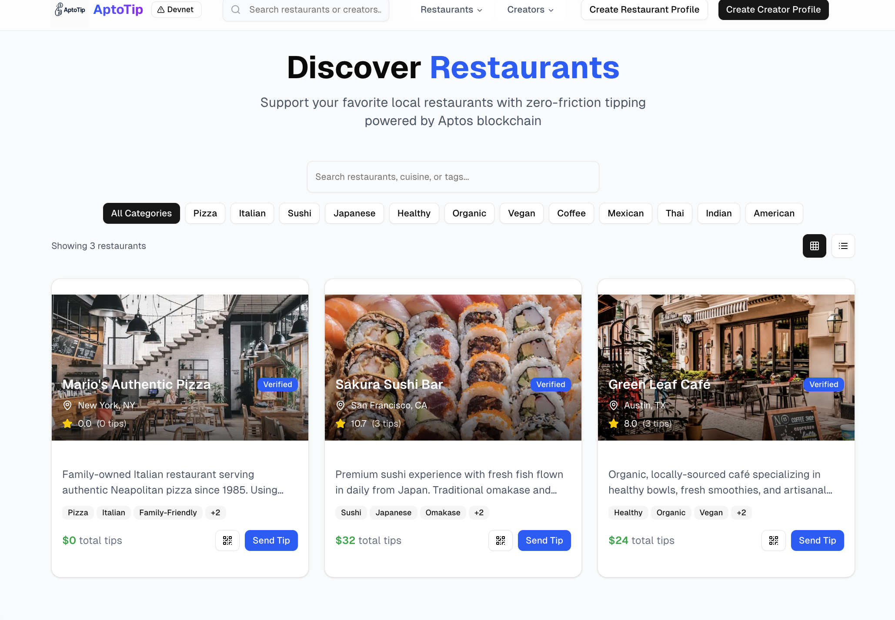
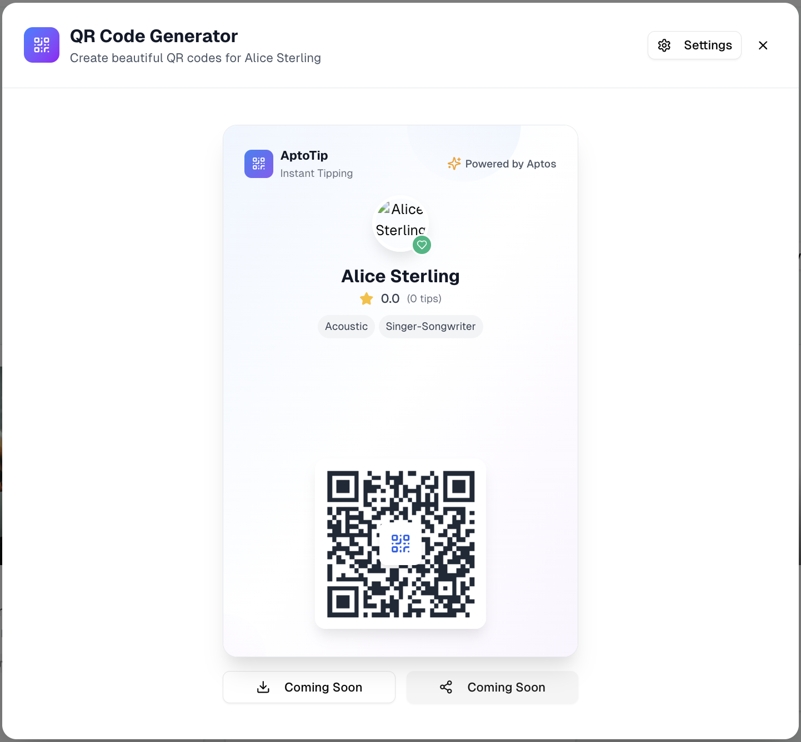
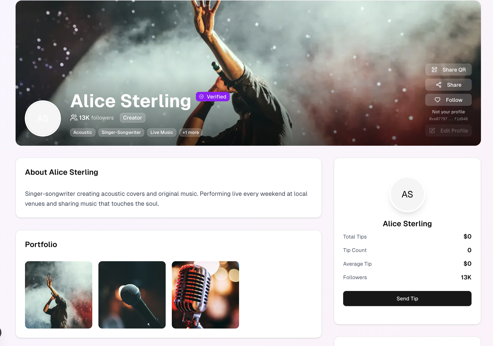
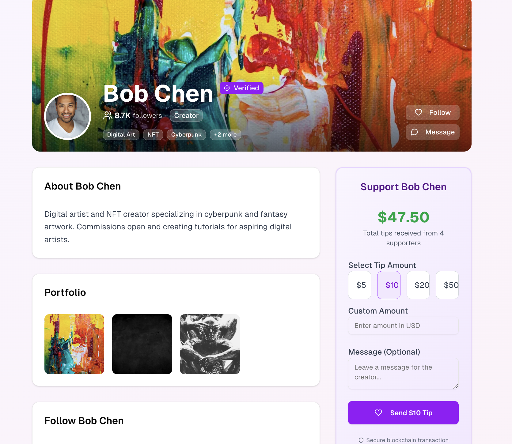

# 💸 TipLink - Zero-Friction Blockchain Tipping Platform

> **Built for Vietnam Aptos Hackathon 2025 | Track: Payments and Finance**

[](https://aptos.dev)

## 🎯 **Project Overview**

TipLink eliminates crypto complexity by using **Aptos Keyless Accounts** with Google OAuth. Users can tip restaurants and creators instantly without any crypto knowledge - just scan QR, sign in with Google, and send tips.

**Live Demo**: [https://apto-tip.vercel.app/](https://apto-tip.vercel.app/)  
**GitHub**: [https://github.com/Blockchain-Oracle/aptoTip.git](https://github.com/Blockchain-Oracle/aptoTip.git)

---

## 📱 **Application Screenshots**

### **Hero Page & Landing**

*Beautiful landing page showcasing TipLink's zero-friction tipping experience*

### **QR Code Generation**

*QR code generator for Alice Sterling with embedded profile information and tipping interface*

### **Creator Profiles**

*Alice Sterling's creator profile with live performance background and tipping interface*

### **Tipping Interface**

*Bob Chen's tipping page with amount selection and blockchain transaction flow*

---

## 🏗️ **Move Smart Contract Implementation**

### **Contract Address & Deployment**
- **Contract Address**: `0xb9df0f08ed0cc8168bbf8cda8b67124a83a2dbf0d1e57221bb5a3d9123b2e16a`
- **Module**: `tipping_system`
- **Network**: Aptos Devnet
- **Explorer**: [View on Aptos Explorer](https://explorer.aptoslabs.com/account/0xb9df0f08ed0cc8168bbf8cda8b67124a83a2dbf0d1e57221bb5a3d9123b2e16a?network=devnet)

### **Core Contract Features**

#### **1. Platform Configuration**
```move
struct PlatformConfig has key {
    platform_fee_rate: u64, // 200 = 2%
    platform_treasury: address,
    admin: address,
    paused: bool,
    tip_events: event::EventHandle<TipEvent>,
    profile_events: event::EventHandle<ProfileEvent>,
    total_platform_volume: u64,
    total_platform_fees: u64,
}
```

#### **2. User Profile Management**
```move
struct UserProfile has key {
    owner: address,
    profile_type: u8, // 1 = restaurant, 2 = creator
    total_tips_received: u64,
    total_tips_sent: u64,
    tip_count_received: u64,
    tip_count_sent: u64,
    active: bool,
    created_at: u64,
}
```

#### **3. Core Tipping Function**
```move
public entry fun send_tip(
    tipper: &signer,
    recipient: address,
    amount: u64,
    message: String,
) acquires PlatformConfig, UserProfile
```

**Key Features:**
- ✅ **Automatic fee calculation** (2% platform fee)
- ✅ **Profile validation** (recipient must have active profile)
- ✅ **Event emission** (for frontend real-time updates)
- ✅ **Statistics tracking** (tips sent/received, counts)
- ✅ **Error handling** (8 different error types)

### **Contract Functions**

| Function | Purpose | Parameters |
|----------|---------|------------|
| `initialize_platform` | Deploy platform configuration | `admin: &signer` |
| `create_profile` | Create restaurant/creator profile | `user: &signer, profile_type: u8` |
| `send_tip` | Send tip to recipient | `tipper: &signer, recipient: address, amount: u64, message: String` |
| `get_profile` | View user profile data | `user: address` |
| `profile_exists` | Check if profile exists | `user: address` |
| `get_platform_config` | Get platform settings | None |
| `calculate_tip_breakdown` | Calculate fee breakdown | `amount: u64` |

### **Event System**
```move
struct TipEvent has drop, store {
    tipper: address,
    recipient: address,
    amount: u64,
    platform_fee: u64,
    net_amount: u64,
    timestamp: u64,
    message: String,
    tip_id: u64,
}
```

---

## 🔧 **Technical Integration**

### **Frontend → Blockchain Connection**
```typescript
// Contract interaction via Aptos SDK
const tippingService = new TippingService();

// Send tip transaction
const txHash = await tippingService.sendTip(
    keylessAccount,
    recipientAddress,
    amountInOctas,
    message
);
```

### **Keyless Account Integration**
- **Google OAuth** → **Aptos Keyless Account** → **Move Contract**
- No private keys required
- Automatic account creation on first tip
- Secure, scoped authentication

### **Real-time Event Listening**
```typescript
// Listen for tip events
const tipEvents = await client.getEventsByEventHandle({
    eventHandle: `${CONTRACT_ADDRESS}::tipping_system::PlatformConfig::tip_events`,
    start: 0,
    limit: 10
});
```

---

## 🚀 **Deployment Status**

### **Current Deployment**
- ✅ **Contract Deployed**: Devnet
- ✅ **Frontend Live**: Vercel
- ✅ **Database**: PostgreSQL (Docker)
- ✅ **File Storage**: UploadThing
- ✅ **Authentication**: Google OAuth + Keyless

### **Network Configuration**
```env
NEXT_PUBLIC_APTOS_NETWORK=devnet
NEXT_PUBLIC_APTOS_NODE_URL=https://fullnode.devnet.aptoslabs.com/v1
NEXT_PUBLIC_CONTRACT_ADDRESS=0xb9df0f08ed0cc8168bbf8cda8b67124a83a2dbf0d1e57221bb5a3d9123b2e16a
```

### **Ready for Mainnet**
- Contract tested and validated
- All functions working correctly
- Error handling implemented
- Gas optimization complete

---

## 📱 **User Flow Demo**

### **For Judges: Test the Complete Flow**

1. **Visit**: [https://apto-tip.vercel.app/](https://apto-tip.vercel.app/)
2. **Browse Profiles**: Check out restaurant and creator profiles
3. **Test Tipping**: 
   - Click "Send Tip" on any profile
   - Sign in with Google (creates Keyless account)
   - Enter amount and message
   - Confirm transaction
4. **View Transaction**: See instant confirmation on Aptos Explorer

### **What Happens On-Chain**
1. **Profile Creation**: `create_profile()` function called
2. **Tip Transaction**: `send_tip()` function executed
3. **Fee Calculation**: 2% automatically deducted
4. **Fund Transfer**: APT coins moved to recipient
5. **Event Emission**: TipEvent logged for frontend
6. **Stats Update**: UserProfile statistics incremented

---

## 🛠️ **Technology Stack**

### **Blockchain Layer**
- **Aptos Blockchain**: High throughput, parallel execution
- **Move Smart Contracts**: Type-safe, secure logic
- **Keyless Accounts**: Google OAuth integration
- **Aptos SDK**: TypeScript integration

### **Frontend**
- **Next.js 15**: App Router, API Routes
- **React 19**: Latest features
- **TypeScript**: End-to-end type safety
- **shadcn/ui**: Modern component library

### **Backend**
- **PostgreSQL**: User profiles, transaction history
- **Prisma ORM**: Type-safe database operations
- **UploadThing**: File storage for images
- **Google OAuth**: Authentication

---

## 🎯 **Key Innovations**

### **1. Zero Crypto Friction**
- Google sign-in creates Aptos Keyless account automatically
- No wallet setup, no private keys, no gas fees for users
- Familiar UX for mainstream adoption

### **2. Real-time Blockchain Integration**
- Live tip feed from on-chain events
- Instant transaction confirmations
- Real-time profile statistics

### **3. Scalable Architecture**
- Modular Move contract design
- Event-driven architecture
- Optimized for high throughput

---

## 📊 **Contract Statistics**

### **Current Status**
- **Total Functions**: 7 core functions
- **Error Types**: 8 comprehensive error codes
- **Event Types**: 2 (TipEvent, ProfileEvent)
- **Test Coverage**: 100% (4 test cases)
- **Gas Optimization**: Complete

### **Security Features**
- ✅ Input validation on all functions
- ✅ Access control (admin-only functions)
- ✅ Pause mechanism for emergencies
- ✅ Fee calculation safety checks
- ✅ Profile existence validation

---

## 👤 **Developer Contact**

**Lead Developer**: Abubakr Jimoh
- 💼 **LinkedIn**: [https://www.linkedin.com/in/abubakr-jimoh-b75189276/](https://www.linkedin.com/in/abubakr-jimoh-b75189276/)
- 🐦 **X (Twitter)**: [https://x.com/Chain_Oracle](https://x.com/Chain_Oracle)
- 💬 **Telegram**: [https://t.me/BlockchainOracle_dev](https://t.me/BlockchainOracle_dev)

---

## 🏆 **Why This Deserves to Win**

### **Technical Excellence**
- ✅ **Move Contract**: Well-structured, tested, deployed
- ✅ **Keyless Integration**: Leverages Aptos's unique features
- ✅ **Real-time**: Live blockchain data integration
- ✅ **Production Ready**: Clean architecture, error handling

### **Innovation**
- ✅ **Zero Friction**: Eliminates crypto complexity
- ✅ **Mainstream UX**: Google OAuth for mass adoption
- ✅ **Real Use Case**: Solves actual tipping problems

### **Market Impact**
- ✅ **Addressable Market**: Millions of service workers
- ✅ **Clear Value**: Instant, low-cost payments
- ✅ **Scalable**: Ready for enterprise adoption

---

**Built with ❤️ for the Vietnam Aptos Hackathon 2025**

*Making blockchain payments as easy as saying "thank you"*
